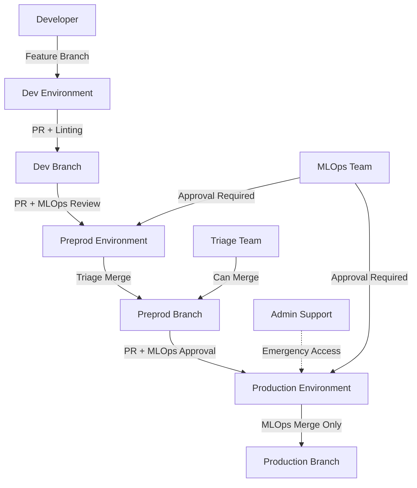

# Dataiku Advanced CI/CD Integration

[](https://github.com/your-org/ci-cd-integration/actions)
[](https://github.com/your-org/ci-cd-integration/actions)

A comprehensive CI/CD workflow system for Dataiku projects with advanced team-based permissions, environment management, and automated quality assurance.

## 🏗️ Architecture Overview

This repository implements a sophisticated three-environment CI/CD pipeline specifically designed for Dataiku projects:



## 🔐 Team Structure & Permissions

### Team Roles

| Team | Permissions | Responsibilities |
|------|------------|------------------|
| **Admin Support** | Full repository admin access | Emergency management, repository settings |
| **Developers** | Write access to `dev` branch only | Feature development, dev branch PRs |
| **Triage Team** | Merge approved PRs to `preprod` | Testing coordination, preprod deployments |
| **MLOps Team** | Review/approve `preprod` & `prod` PRs | Production oversight, deployment approval |

### Branch Permissions

| Branch | Who Can Push | Who Can Merge PRs | Review Requirements |
|--------|--------------|-------------------|-------------------|
| `dev` | Developers, Admin | Developers, Admin | 1 approval + linting |
| `preprod` | Triage, MLOps, Admin | Triage, MLOps, Admin | MLOps approval + testing |
| `main/prod` | MLOps, Admin | MLOps, Admin | 2 MLOps approvals + validation |

## 🚀 CI/CD Workflows

### 1. Development Workflow (`dev-ci.yml`)
**Triggered on**: Push/PR to `dev` branch

**Quality Checks**:
- ✅ Ruff linting and formatting
- ✅ Dataiku project structure validation
- ✅ Recipe import and error handling checks
- ✅ Security scan for hardcoded secrets
- ✅ Team permission validation

### 2. Preprod Workflow (`preprod-ci.yml`)
**Triggered on**: PR/Push to `preprod` branch

**Comprehensive Testing**:
- ✅ All dev checks plus additional validation
- ✅ Unit test execution with coverage
- ✅ Dataiku recipe production readiness
- ✅ Dataset schema validation
- ✅ Integration testing with mock environment
- ✅ Security and compliance scanning

### 3. Production Workflow (`prod-ci.yml`)
**Triggered on**: PR/Push to `main/prod` branch

**Production Deployment**:
- ✅ MLOps team access validation
- ✅ Production-grade security scanning
- ✅ Performance and load testing
- ✅ Backup and rollback preparation
- ✅ Deployment with monitoring setup
- ✅ 24-hour post-deployment monitoring

## 📁 Project Structure

```
ci-cd-integration/
├── .github/
│   ├── workflows/
│   │   ├── dev-ci.yml              # Development CI workflow
│   │   ├── preprod-ci.yml          # Preprod CI/CD workflow
│   │   └── prod-ci.yml             # Production deployment workflow
│   └── CODEOWNERS                  # Code review requirements
├── requirements.txt                # Core project dependencies
├── requirements-dev.txt            # Development dependencies
├── requirements-test.txt           # Testing dependencies
├── pyproject.toml                  # Python project configuration
├── .pre-commit-config.yaml         # Pre-commit hooks configuration
├── TEAM_SETUP.md                   # Team and repository setup guide
└── README.md                       # This file
```

Future Dataiku project structure:
```
your-dataiku-project/
├── recipes/                        # Dataiku recipes (Python scripts)
├── datasets/                       # Dataset configurations
├── lib/                           # Shared libraries
├── tests/                         # Unit and integration tests
├── params.json                    # Project parameters
└── [CI/CD files from above]       # Copy these files to your project
```

## 🛠️ Setup Instructions

### 1. Repository Setup

1. **Copy CI/CD files** to your Dataiku project repository
2. **Configure GitHub teams** following [`TEAM_SETUP.md`](TEAM_SETUP.md)
3. **Set up branch protection rules** as documented
4. **Configure repository secrets** for environment deployment

### 2. Local Development Setup

```bash
# Clone the repository
git clone https://github.com/your-org/your-dataiku-project.git
cd your-dataiku-project

# Install development dependencies
pip install -r requirements-dev.txt

# Install pre-commit hooks
pre-commit install

# Create your first feature branch from dev
git checkout -b feature/my-awesome-feature dev
```

### 3. Environment Secrets Configuration

Configure these secrets in your GitHub repository settings:

**Production Environment:**
```
DATAIKU_PROD_API_KEY=your-production-api-key
DATAIKU_PROD_URL=https://your-prod-dataiku-instance.com
PROD_DATABASE_URL=your-production-database-connection
```

**Preprod Environment:**
```
DATAIKU_PREPROD_API_KEY=your-preprod-api-key
DATAIKU_PREPROD_URL=https://your-preprod-dataiku-instance.com
PREPROD_DATABASE_URL=your-preprod-database-connection
```

**Development Environment:**
```
DATAIKU_DEV_API_KEY=your-dev-api-key
DATAIKU_DEV_URL=https://your-dev-dataiku-instance.com
DEV_DATABASE_URL=your-dev-database-connection
```

## 🔄 Development Workflow

### For Developers

1. **Create Feature Branch**:
   ```bash
   git checkout dev
   git pull origin dev
   git checkout -b feature/your-feature-name
   ```

2. **Develop and Test Locally**:
   ```bash
   # Install dependencies
   pip install -r requirements-dev.txt
   
   # Run linting
   ruff check .
   ruff format .
   
   # Run tests
   pytest tests/
   ```

3. **Commit Changes**:
   ```bash
   git add .
   git commit -m "feat: add new data processing recipe"
   # Pre-commit hooks will run automatically
   ```

4. **Create Pull Request**:
   ```bash
   git push origin feature/your-feature-name
   # Create PR to dev branch via GitHub UI
   ```

5. **Merge to Dev**:
   - Wait for CI checks to pass
   - Get approval from team member
   - Merge via GitHub

### For MLOps Team - Preprod Deployment

1. **Create Preprod PR**:
   ```bash
   git checkout preprod
   git pull origin preprod
   git checkout -b release/v1.2.0 dev
   git push origin release/v1.2.0
   # Create PR from release/v1.2.0 to preprod
   ```

2. **Review and Approve**:
   - Review all changes since last preprod deployment
   - Check comprehensive test results
   - Approve PR

3. **Triage Team Merges**:
   - Triage team merges after MLOps approval
   - Automated deployment to preprod environment

### For MLOps Team - Production Deployment

1. **Create Production PR**:
   ```bash
   git checkout main
   git pull origin main
   git checkout -b production-release/v1.2.0 preprod
   git push origin production-release/v1.2.0
   # Create PR from production-release/v1.2.0 to main
   ```

2. **Production Review Process**:
   - **Required**: 2 MLOps team member approvals
   - **Required**: Review deployment report
   - **Required**: Verify rollback plan
   - **Required**: Check all production validations pass

3. **Production Deployment**:
   - Only MLOps team can merge
   - Automated production deployment
   - 24-hour monitoring period
   - Rollback available if needed

## 🔍 Quality Assurance Features

### Automated Linting & Formatting
- **Ruff**: Fast Python linter and formatter
- **Pre-commit hooks**: Run checks before commits
- **Black**: Code formatting consistency
- **MyPy**: Static type checking

### Dataiku-Specific Validations
- Recipe structure validation
- Required import checks (`import dataiku`)
- Error handling verification
- Dataset configuration validation
- Production readiness checks

### Security & Compliance
- Hardcoded secret detection
- Dependency vulnerability scanning
- Data governance metadata validation
- Access pattern analysis

### Testing Framework
- Unit tests with pytest
- Integration tests with mock Dataiku environment
- Coverage reporting
- Performance testing
- Load testing simulation

## 📊 Monitoring & Alerting

### Deployment Monitoring
- Real-time deployment status
- Performance metrics tracking
- Error rate monitoring
- Resource utilization alerts

### Quality Metrics
- Code coverage tracking
- Linting rule compliance
- Security scan results
- Test execution reports

### Team Notifications
- Slack/Teams integration ready
- Email notifications for failures
- PR review reminders
- Deployment status updates

## 🚨 Emergency Procedures

### Hotfix Process
```bash
# Create hotfix from production
git checkout main
git checkout -b hotfix/critical-bug-fix

# Make minimal fix
# ... edit files ...

# Create direct PR to main (admin approval required)
git push origin hotfix/critical-bug-fix
# Create PR to main - requires admin approval
```

### Rollback Process
1. Access rollback plan from deployment artifacts
2. MLOps team lead approves rollback
3. Execute automated rollback workflow
4. Verify system stability
5. Post-incident review and documentation

## 📝 Contributing

1. Read the [`TEAM_SETUP.md`](TEAM_SETUP.md) guide
2. Follow the development workflow above
3. Ensure all CI checks pass
4. Get required approvals based on target branch
5. Follow team-specific merge procedures

## 🆘 Support & Troubleshooting

### Common Issues

**CI Checks Failing?**
- Run `ruff check .` and `ruff format .` locally
- Check for hardcoded secrets or environment references
- Ensure Dataiku recipes have proper imports and error handling

**Permission Denied?**
- Verify you're on the correct team for the target branch
- Check branch protection rules in repository settings
- Contact admin team for access issues

**Deployment Failures?**
- Check environment secrets configuration
- Verify Dataiku instance connectivity
- Review deployment logs in Actions tab

### Getting Help

- **Development Issues**: Contact `@your-org/developers`
- **Deployment Issues**: Contact `@your-org/mlops`
- **Repository Access**: Contact `@your-org/admin-support`
- **Emergency**: Follow emergency procedures above

## 📚 Additional Resources

- [Team Setup Guide](TEAM_SETUP.md) - Complete team and repository configuration
- [Dataiku Documentation](https://doc.dataiku.com/) - Official Dataiku docs
- [GitHub Actions](https://docs.github.com/en/actions) - GitHub Actions documentation
- [Ruff Documentation](https://docs.astral.sh/ruff/) - Linting and formatting guide

---

**🎉 Happy Dataiku Development!** 

This CI/CD system ensures your Dataiku projects are developed, tested, and deployed with enterprise-grade quality and security standards. 